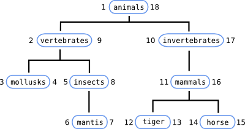

Baobab ( a library applying the *nested set model* )
====================================================

.. toctree::
   :hidden:
   :maxdepth: 2
   
   baobab.rst
   faq.rst

.. role:: raw-html(raw)
   :format: html

..
    Indices and tables
    ==================
    
    * :ref:`genindex`
    * :ref:`search`

Baobab is a library to save tree structured data in a relational database.

Currently there is only a PHP implementation working with MySQL, but it shouldn't
be too difficult to port to other languages or databases (most of the work is
done via SQL queries and the code is mostly a support to them).

The technique used is [#joe_celko]_ Joe Celko's [#nested_set_model]_ *nested set model*,
modified so that a table can hold more than one tree, to help with cases such as
storing threads of a forum (each thread is a tree and they all have an identical
structure).

We have about one hundred tests to ensure the library is doing The Right Thing (™),
a straightforward thread safe :ref:`API <api>` and a clean documentation.

How does the *nested set model* work ?
--------------------------------------

Let's say you want to save some hierarchical data in your database.

In the image we can see how each node has two numbers (left and right) assigned
to it during a depth-first traversal of the tree. Well, the nested set model is
all about assigning this numbers and mantain them coherent whenever a node is
inserted, moved or deleted.
With this numbers in place we gain various benefits. The tree structure of the
data his mantained in a relational database and we're able to do some
really fast searches. Normally slow operations like finding the path between two
nodes, knowing all the descendants of a node or discover if a node is ancestor of
another are blazing fast.
Too, the horizontal order is preserved without the need of others attributes.

The previous tree could be represented in a SQL table like so

=====  =======  =====
lft    rgt      label
=====  =======  =====
1      18       animals
2      9        vertebrates
3      4        mollusks
5      8        insects
6      7        mantid
10     17       invertebrates
11     16       mammals
12     13       tiger
14     15       horse
=====  =======  =====

some simple properties ...

* root node has halways lft equals to 1.
* the number of a node's descendants is ⌊(rgt-left)/2⌋
* the ancestors of a node have both lft ≤ nodeLft and rgt ≥ nodeRgt

This is just an introduction, if you want to know more about *nested set models* I suggest you to read 
[#joe_celko_trees]_ **Trees and hierarchies in SQL for smarties** and/or
[#joe_celko_sql_for_smarties]_ **SQL for smarties**, both written by Joe Celko.
Online you could read a couple [#more]_ more resources.

How can Baobab help ?
---------------------

Baobab leverage the works of administering such table. In particular moving or
inserting after a particular node can be pretty complicated, and Baobab do the
hard work for you. :raw-html:` `
If you feel like so, you can use Baobab for all the tree changing tasks (the most
tedious queries) and write your own queries to search what you want in the most
optimized way. :raw-html:` `
However Baobab provide functions for the laziest programmers.

Here it is a list of the functions provided

* creation
  
  * :class:`build() <Baobab.build>`
  * :class:`destroy() <Baobab.destroy>`

* retrieval
  
  * :class:`getRoot() <Baobab.getRoot>`
  * :class:`getTreeSize() <Baobab.getTreeSize>`
  * :class:`getDescendants() <Baobab.getDescendants>`
  * :class:`getLeaves() <Baobab.getLeaves>`
  * :class:`getLevels() <Baobab.getLevels>`
  * :class:`getPath() <Baobab.getPath>`
  * :class:`getChildren() <Baobab.getChildren>`
  * :class:`getFirstNChildren() <Baobab.getFirstNChildren>`
  * :class:`getFirstChild() <Baobab.getFirstChild>`
  * :class:`getLastChild() <Baobab.getLastChild>`
  * :class:`getTree() <Baobab.getTree>`
  * :class:`getTreeHeight() <Baobab.getTreeHeight>`
  * :class:`getChildAtIndex() <Baobab.getChildAtIndex>`
  * :class:`getNodeData() <Baobab.getNodeData>`

* insertions
  
  * :class:`appendChild() <Baobab.appendChild>`
  * :class:`insertNodeAfter() <Baobab.insertNodeAfter>`
  * :class:`insertNodeBefore() <Baobab.insertNodeBefore>`
  * :class:`insertChildAtIndex() <Baobab.insertChildAtIndex>`

* editing

  * :class:`updateNode() <Baobab.updateNode>`

* tree moving
  
  * :class:`moveSubTreeAfter() <Baobab.moveSubTreeAfter>`
  * :class:`moveSubTreeBefore() <Baobab.moveSubTreeBefore>`
  * :class:`moveSubTreeAtIndex() <Baobab.moveSubTreeAtIndex>`

* deletion
  
  * :class:`deleteSubtree() <Baobab.deleteSubtree>`
  * :class:`clean() <Baobab.clean>`
  * :class:`close_gaps() <Baobab.close_gaps>`

* data liberation
  
  * :class:`import() <Baobab.import>`
  * :class:`exort() <Baobab.export>`

All of the \*_index() functions accept negative numbers too, and all the functions
that modify the tree preserve the lft/rgt consistency.

Dependencies
------------

* PHP >= 5.2 with *mysqli* module
* MySQL >= 5.0 with *innodb* tables available

.. rubric:: Footnotes

.. [#joe_celko] `Joe Celko <http://www.simple-talk.com/author/joe-celko/>`_

.. [#nested_set_model] `Wikipedia on Nested set model <http://en.wikipedia.org/wiki/Nested_set_model>`_

.. [#more] `Managing Hierarchical Data in MySQL <http://dev.mysql.com/tech-resources/articles/hierarchical-data.html>`_

.. [#joe_celko_trees] `Joe Celko's Trees and hierarchies in SQL for smarties <http://books.google.com/books?id=uw2lq2o4VbUC&lpg=PP1&ots=DrPX6ljhOC&dq=Trees%20and%20Hierarchies%20in%20SQL%20for%20Smarties&pg=PP1#v=onepage&q&f=false>`_

.. [#joe_celko_sql_for_smarties] `Joe Celko's SQL for smarties: advanced SQL programming <http://books.google.com/books?id=Hi9fMnOoRtAC&lpg=PP1&dq=joe%20celko's%20sql%20for%20smarties&pg=PP1#v=onepage&q&f=false>`_